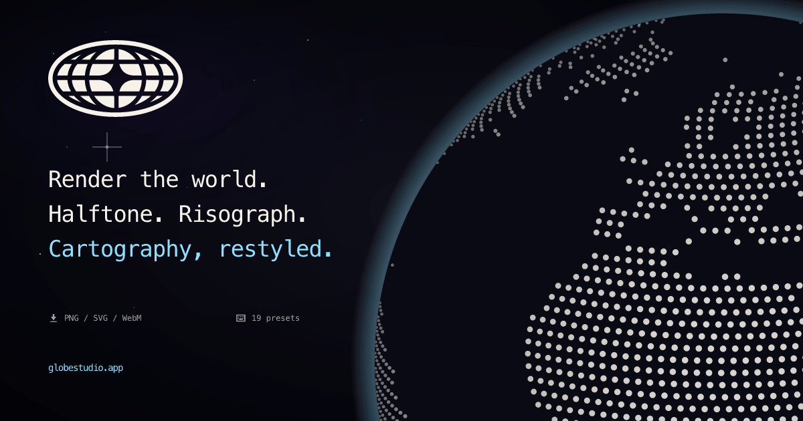

<div align="center">

# Globestudio

**Open-source dotted maps and animated 3D globes for designers, animators, and creative developers.**

<a href="https://globestudio.app"></a>

Pick a country or the whole world, customize dots and shapes, apply shader effects, and export PNG, SVG, or animated WebM. Built on React + Three.js.

[**globestudio.app**](https://globestudio.app/) · [Live demos](https://globestudio.app/) · [Roadmap](ROADMAP.md) · [Discussions](https://github.com/alevizio/globestudio/discussions)

[](https://github.com/alevizio/globestudio/actions/workflows/ci.yml)
[](LICENSE)
[](CONTRIBUTING.md)

</div>

---

## Why Globestudio?

Most open-source map tooling is built for engineers — tile servers, geocoding,
GIS data pipelines. Globestudio is built for the **other half of the stack**:
the landing-page hero shot, the launch teaser, the explainer scrollytell, the
deck slide that needs a globe but not a database.

Think of it as **a Shader Lab for maps and globes** — a designer-first canvas
with presets, effects, motion, and clean exports. Composable, web-native, and
yours to remix.

## Features

- 🌍 **Maps for any scope** — world, country, continent, subregion, US state
- 🔄 **Flat ↔ 3D globe** — same dot data, two views, smooth morph
- 🎨 **12 dot shapes + custom upload** — Circle · Hexagon · Triangle · Pentagon ·
  Square · Diamond · Star · Plus · Ring · Voxel · Particle Grid · ASCII glyphs ·
  your own SVG/PNG
- 🪄 **21 shader looks** — Halftone, Risograph, Newsprint, Aurora, Pixel,
  Bayer, Atkinson, Wireframe, CRT, Glitch, Bad TV, Bloom, Metal, Iridescent,
  Pencil, Corrupt, Toon, Threshold, Vapor, Topographic — plus the base
  Default. Stackable on any preset.
- 🌈 **Gradients + alpha** on dot color, land fill, and country stroke
- ✨ **Live animations** — rotation, twinkle, size jitter, network arcs,
  motion-aware (respects `prefers-reduced-motion`)
- 🎛️ **21 curated presets** — every shader look is a one-click preset with
  matching backgrounds, density, dot size, and globe chrome. Shareable
  URLs at `/looks/:id`.
- 💾 **Real exports** — PNG (high-res via WebGL re-render), SVG (with shader
  effects baked in), WebM video (looped or one-shot), JSON config
- ⌨️ **Full keyboard system** — `S` shuffle, `[`/`]` cycle presets, `D` export,
  `R` reset, `G` toggle view, `H` toggle panel, `?` help
- ♿ **Accessibility** — WCAG 2.2 AA conformant. Keyboard-first, screen-
  reader proxy DOM for canvas state, focus trap on modals, motion
  preferences honored. See [`ACCESSIBILITY.md`](ACCESSIBILITY.md)

## Quickstart

### Use it

The live tool runs entirely client-side:

→ **[globestudio.app](https://globestudio.app/)**

Pick a country, tweak the look, export.

### Run it locally

Requires Node 20+ and npm.

```bash
git clone https://github.com/alevizio/globestudio
cd globestudio
npm install
npm run dev
```

Open `http://127.0.0.1:5173/`.

### Build it

```bash
npm run build      # → dist/
npm run preview    # serve dist/ locally
npm test -- --run  # 173 tests across 26 files
npm run test:e2e   # browser smoke + accessibility checks
```

## Embed it anywhere

Globestudio ships two embed paths — pick whichever fits the tool:

### One-line script tag (Recommended)

```html
<div data-globestudio data-look="halftone" data-density="50"
     style="width: 100%; height: 480px;"></div>
<script async src="https://globestudio.app/embed.js"></script>
```

~3kb gzipped, zero dependencies, works in Webflow / Squarespace / blog
posts / anywhere HTML is allowed. Every embed param has a matching
`data-*` attribute. Watches the DOM for later-added elements via
MutationObserver, so SPAs and dynamic content work too.

### Plain iframe

```html
<iframe
  src="https://globestudio.app/embed?look=halftone&density=70&autoSpin=1"
  width="100%"
  height="500"
  style="border:0"
  loading="lazy"
  title="Globestudio dotted globe"
></iframe>
```

Resize-aware via `postMessage` — listen for
`{ type: "globestudio-resize", height }` from the embed and resize the
iframe to match. WebGL required; falls back to a still preview + a
"how to enable WebGL" panel if the GL context can't be created.

### Embed parameters

The canonical parameter table. Every query param the `/embed` route honors,
as parsed in [`src/components/embed-view.jsx`](src/components/embed-view.jsx):

| Param | Type / range | Default | What it does |
|---|---|---|---|
| `look` | preset id (one of the 21 looks) | `default` | Base look preset — params below override it |
| `selection` | `world` · `country:<ISO3>` · `continent:<Name>` · `subregion:<Name>` | `world` | What geography to draw |
| `density` | number, 1–90 | `40` | Dot grid density (invalid values fall back to the preset's) |
| `dotSize` | number, 0.1–25 | `10` | Dot size (invalid values fall back to the preset's) |
| `dotColor` | hex, `#` optional | preset's | Dot color |
| `worldFill` | hex, `#` optional | preset's | Land fill color |
| `renderMode` | `dots` · `solid` | preset's | Dot field or solid landmass |
| `motion` | number, 0–100 | `35` | Parsed but currently inert — reserved, no effect yet |
| `tiltX` | number, −45 to 45 | `0` | Camera tilt, degrees |
| `tiltY` | number, −45 to 45 | `0` | Camera tilt, degrees |
| `autoSpin` | `1` · `0` | `1` | Auto-rotate the globe |
| `static` | `1` · `0` | `0` | Freeze all motion (static previews in design-tool canvases) |
| `view` | `globe` · `flat` | `globe` | 3D globe or flat map |
| `background` | hex, `#` optional | unset | Page background behind the canvas (only painted when set) |
| `theme` | `dark` · `light` | `dark` | Globe chrome palette — `light` reads cleanly on light host pages |
| `transparent` | `1` · `0` | `0` | See-through document, composites onto the host page |
| `plugin` | `figma` | unset | Host-plugin shell (the Figma plugin's Insert button) |
| `source` | string | `embed` | Analytics tag, echoed in resize `postMessage`s |
| `c` | URL-encoded config JSON | unset | Full share-config payload (what the Share dialog produces) — overrides the preset and the params above |

A JSON Schema for the `c` payload lives at
[`/schema/config.json`](public/schema/config.json).

**Per-tool integration guides** live at
[globestudio.app/integrations](https://globestudio.app/integrations) —
copy-paste setups for Webflow, Framer, Figma, Notion, WordPress, plain
HTML, and React. In this repo:
[Figma plugin](figma-plugin/) ·
[WordPress plugin](wordpress-plugin/globestudio/) ·
[Framer component](examples/framer-component/) ·
[embed snippet](examples/embed-snippet/)

**Reading material:**
[How to make a dotted world map in 2026](docs/blog/2026-05-how-to-make-a-dotted-world-map.md) ·
[All articles →](docs/blog/)

## Use it from AI tools (MCP)

Globestudio ships a [Model Context Protocol](https://modelcontextprotocol.io)
server, so Claude, Cursor, and any MCP-compatible assistant can generate
globes, build share URLs, and grab embed snippets straight from a chat:

```bash
claude mcp add globestudio -- npx -y @globestudio/mcp
```

Full tool list and setup in [`packages/mcp/README.md`](packages/mcp/README.md).

## What you can build with it

| Use case | What it gives you |
|---|---|
| **Landing page hero** | A live animated globe behind your headline. Export PNG for static, WebM for video. |
| **Launch teaser** | Animated dot map of where your users are. WebM ready for X/LinkedIn. |
| **Deck visuals** | Per-country SVGs that drop straight into Keynote, Figma, or print layouts. |
| **Data story** | Hand-picked region + dot palette for a feature, blog post, or report. |
| **Brand system** | A consistent dotted-globe mark across your site, app, and docs. |
| **Stream / podcast graphic** | Looping WebM background with the CRT or Glitch preset. |

### Runnable examples

The [`examples/`](./examples) directory holds 9 reference projects —
runnable HTML, drop-in components, and adaptation guides. Highlights:

- [`embed-snippet`](./examples/embed-snippet) — the minimum-viable iframe
  pattern. Copy into Webflow, Framer, Notion, plain HTML, anywhere.
- [`hero-globe`](./examples/hero-globe) — full-bleed animated globe behind
  a landing-page hero.
- [`shader-presets-showcase`](./examples/shader-presets-showcase) — the
  shader presets in one auto-fit gallery, perfect for picking a look.

Share what you make in [Show & Tell](https://github.com/alevizio/globestudio/discussions/categories/show-and-tell).

## Documentation

| | |
|---|---|
| [CONTRIBUTING](CONTRIBUTING.md) | Local setup, project shape, design rules, how to submit presets/examples |
| [ROADMAP](ROADMAP.md) | What's shipped, what's next, what's parked |
| [CHANGELOG](CHANGELOG.md) | What changed and when |
| [GOVERNANCE](GOVERNANCE.md) | How decisions get made |
| [CODE_OF_CONDUCT](CODE_OF_CONDUCT.md) | Community standards |
| [SECURITY](SECURITY.md) | Reporting vulnerabilities |
| [SUPPORT](SUPPORT.md) | Where to ask questions |

## How it compares

There's no shortage of map and globe tools — Globestudio doesn't try
to replace any of them. It owns the **aesthetic-asset shelf**: stylized
output that ships to a landing page hero, deck slide, OG card, or
launch teaser. Different tools for different jobs:

| | Globestudio | [globe.gl](https://github.com/vasturiano/globe.gl) | [Mapbox Studio](https://www.mapbox.com/mapbox-studio) | [Felt](https://felt.com) | [Haikei](https://haikei.app) |
|---|---|---|---|---|---|
| **3D globe out of box** | ✅ | ✅ | ❌ | ❌ | ❌ |
| **Dotted maps** | ✅ 12 shapes | partial | ❌ | ❌ | ❌ |
| **Shader aesthetic looks** | ✅ **21** | ❌ | custom WebGL only | ❌ | ❌ |
| **Multiple projections** | 5 | sphere only | many | many | n/a |
| **No-code GUI** | ✅ | ❌ library | ✅ | ✅ | ✅ |
| **PNG / SVG / WebM export** | ✅ | manual | print / PDF | ✅ | PNG / SVG |
| **Embed iframe** | ✅ `/embed` | DIY | ✅ | ✅ | DIY |
| **Framer / Webflow components** | ✅ | ❌ | plugins | ❌ | ❌ |
| **No signup / no API key** | ✅ | n/a | ❌ | ❌ | ✅ |
| **Free + MIT** | ✅ | ✅ (library) | freemium | paid | free, closed |

**What Globestudio gives up**: GIS-accurate data overlays, large dataset
analysis, real-time collaboration. If those are what you need, reach
for Mapbox / Felt / Kepler — they're great at them.

**Built on the shoulders of**: [globe.gl](https://github.com/vasturiano/globe.gl)
and [COBE](https://github.com/shuding/cobe) defined what a modern OSS
3D globe library looks like. [dotted-map](https://github.com/NTag/dotted-map)
is the engine under the dot field. [Stamen Maps](https://maps.stamen.com)
was the spiritual ancestor of "maps as visual aesthetic."

## Tech stack

Built with:

- **[React 19](https://react.dev)** + **[Vite](https://vite.dev)** for the app shell
- **[Three.js](https://threejs.org)** for the WebGL globe, instanced dot rendering, shader effects, network arcs
- **[dotted-map](https://github.com/NTag/dotted-map)** for the source dot field
- **[d3-geo](https://d3js.org/d3-geo)** + **[d3-geo-projection](https://github.com/d3/d3-geo-projection)** + **[topojson-client](https://github.com/topojson/topojson-client)** for projections (Mercator, Equirectangular, Equal Earth, Winkel Tripel, Robinson) and topology decoding
- **[world-countries](https://github.com/mledoze/countries)** + **[world-atlas](https://github.com/topojson/world-atlas)** + **[us-atlas](https://github.com/topojson/us-atlas)** for source geography
- **[satori](https://github.com/vercel/satori)** + **[@resvg/resvg-js](https://github.com/yisibl/resvg-js)** for the OG share card pipeline (JSX → SVG → PNG at build time)
- **[Pixelarticons](https://pixelarticons.com)** by Gerrit Halfmann for the in-app icon set — 24×24 pixel-grid icons with `currentColor` fill so they theme cleanly
- **[Vitest](https://vitest.dev)** + **[Testing Library](https://testing-library.com)** + **[axe-core](https://github.com/dequelabs/axe-core)** for tests and the WCAG 2.2 AA accessibility guard

No backend and no accounts. Privacy-respecting Vercel Analytics and Speed
Insights honor Do Not Track, Global Privacy Control, and the local opt-out in
`/privacy`; everything else renders in your browser.

## Contributing

We want contributions. Code, presets, example projects, screenshots, docs
rewrites — all of it counts.

The shortest path:

1. **Build something cool with the live tool** → drop it in
   [Show & Tell](https://github.com/alevizio/globestudio/discussions/categories/show-and-tell)
2. **Found a bug?** → [Bug report](https://github.com/alevizio/globestudio/issues/new?template=bug-report.yml)
3. **Made a preset you love?** → [Preset submission](https://github.com/alevizio/globestudio/issues/new?template=preset-submission.yml)
4. **Have an idea?** → [Ideas discussion](https://github.com/alevizio/globestudio/discussions/new?category=ideas)

Full guide in [CONTRIBUTING.md](CONTRIBUTING.md).

## License

[MIT](LICENSE). Use it, remix it, ship it. If you use it commercially or
prominently we'd love to hear about it (no obligation, just curious).

The included geography data comes from
[world-atlas](https://github.com/topojson/world-atlas),
[us-atlas](https://github.com/topojson/us-atlas), and
[world-countries](https://github.com/mledoze/countries) — all with permissive
licenses. If you build on top of derived map data outside this repo,
double-check the source attributions.

---

<div align="center">

Made by **[@alevizio](https://github.com/alevizio)** · [alevizio.com](https://alevizio.com) · [twitter.com/alevizio](https://twitter.com/alevizio)

</div>
