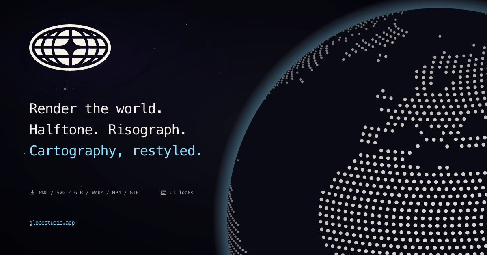

<div align="center">

# Globestudio

**Open-source dotted maps and animated 3D globes for designers, animators, and creative developers.**

<a href="https://globestudio.app"></a>

Pick a country or the whole world, choose a look, change the dots and colors, and export PNG, SVG, GLB, WebM, MP4, or GIF. Built with React and Three.js.

[**globestudio.app**](https://globestudio.app/) · [All 21 looks](https://globestudio.app/gallery) · [Roadmap](ROADMAP.md) · [Discussions](https://github.com/alevizio/globestudio/discussions)

[](https://github.com/alevizio/globestudio/actions/workflows/ci.yml)
[](LICENSE)
[](CONTRIBUTING.md)
[](https://skills.sh/alevizio/globestudio/globestudio)

</div>

---

## Why Globestudio?

Most open-source map tools are built for engineers: tile servers, geocoding,
GIS pipelines. Globestudio is for when the map is the picture, like a landing
page hero, a launch teaser, a scrollytelling explainer, or a deck slide that
needs a globe but not a database.

You work by eye with the studio's controls and export when it looks right.
The studio runs in your browser, and the code is MIT licensed.

## Features

- Maps of the world, a continent, a subregion, a country, or a US state.
- Flat map or 3D globe, drawn from the same dots, with a morph between the two.
- 12 dot shapes (Circle, Hexagon, Triangle, Pentagon, Square, Diamond, Star,
  Plus, Ring, Voxel, Particle Grid, ASCII glyphs), or upload your own SVG,
  PNG, JPEG or WebP.
- 21 looks: Default plus 20 shader looks (Halftone, Risograph, Newsprint,
  Aurora, Pixel, Bayer, Atkinson, Wireframe, CRT, Glitch, Bad TV, Bloom,
  Metal, Iridescent, Pencil, Corrupt, Toon, Threshold, Vapor, Sonar).
  Each look is a one-click preset that sets the background, density, dot
  size and globe chrome, applies at most one shader pass, and has its own
  URL at `/looks/:id`. You can change the shape, colors and region after
  picking one.
- Gradients and alpha on the dot color, land fill, and country stroke.
- Your own data: paste `lat,lng,value` or `country,value` lines to plot
  markers sized by value, optionally joined by arcs. Try an example fills in
  eight cities to start from.
- Solid maps: filled land and stroked borders, river and city overlays,
  pasted GeoJSON lines and points, and 5 flat projections (Mercator, Equal
  Earth, Natural Earth, Winkel Tripel, Robinson). Dotted maps use Mercator.
- Animations: rotation, twinkle, size jitter, and network arcs. They stop
  under `prefers-reduced-motion`.
- Exports: PNG at 1x to 4x (the WebGL scene is re-rendered at that size); SVG
  with clean vector dots (6 effects are approximated with SVG filters, and
  the full shader look needs PNG or video; when a design has something the
  vectors leave out, such as a look's effect, solid land or a Space
  background, the SVG and Figma tabs name it); a GLB 3D model for three.js,
  Blender and other 3D tools, with the dots, the globe and the arcs in flat
  colors and no shader effect or animation; WebM, MP4 (where the browser
  can encode it), and GIF video; and a JSON config. Copy image puts the same
  PNG on the clipboard, ready to paste into Figma, Slides, Slack or Notion.
- Keyboard shortcuts: `S` shuffle, `[`/`]` cycle looks, `D` export, `R`
  reset, `G` toggle view, `H` toggle panel, `?` help.
- Accessibility: targets WCAG 2.2 AA and was self-audited. It works from the
  keyboard, a hidden DOM mirror describes the canvas state to screen readers,
  and reduced motion is respected. Known gaps are listed in
  [`ACCESSIBILITY.md`](ACCESSIBILITY.md).

## Quickstart

### Use it

The live tool runs entirely in your browser at
**[globestudio.app](https://globestudio.app/)**, and you don't need an
account.

### Run it locally

Requires Node 20.19+ (or 22.12+) and npm.

```bash
git clone https://github.com/alevizio/globestudio
cd globestudio
npm install
npm run dev
```

Open `http://127.0.0.1:5173/` and the studio loads. `VITE_TEASER=1 npm run dev`
shows the pre-launch waitlist teaser instead. Deploys set `VITE_TEASER=0`.

### Build it

```bash
npm run build      # → dist/
npm run preview    # serve dist/ locally
npm test -- --run  # the full Vitest suite
npm run test:e2e   # browser smoke + accessibility checks
```

## Embed it anywhere

### One-line script tag (recommended)

```html
<div data-globestudio data-look="halftone" data-density="50"
     style="width: 100%; height: 480px;"></div>
<script async src="https://globestudio.app/embed.js"></script>
```

About 3 KB gzipped, with no dependencies. It works in Webflow, Squarespace,
blog posts, and anywhere else you can add a script tag. Every embed param
except `plugin` has a matching `data-*` attribute (`c` is `data-config`,
and `data-theme` passes only `light`). The script watches the
DOM with a MutationObserver and mounts elements added later, so SPAs and
dynamic content work too.

### Plain iframe

```html
<iframe
  src="https://globestudio.app/embed?look=halftone&density=70&autoSpin=1"
  width="100%"
  height="500"
  style="border:0"
  loading="lazy"
  title="Globestudio dotted globe"
></iframe>
```

The embed posts `{ type: "globestudio-resize", height }` through
`postMessage`; listen for it and resize the iframe to match. It needs WebGL 2.
Without it, the embed shows a short note and a link to open Globestudio in a
supported browser.

### React component or web component

```bash
npm install @globestudio/react     # <Globe look="aurora" />
npm install @globestudio/element   # <globe-studio look="aurora"></globe-studio>
```

Both wrap the same `/embed` route in an iframe, so every look works in both.
Setup and props: [`packages/react`](packages/react/) and
[`packages/web-component`](packages/web-component/). For a new React project,
start from the [React starter](examples/starter-react/).

On a light page, set `theme="light"` on either one. It sends the `theme`
param below: the glow and grid switch to a palette for light pages, and
Wireframe's white ink, which all but vanishes there, turns graphite.
Halftone, Toon and Threshold paint a dark page of their own, where graphite
ink is lost, so make them see-through in the config as well:
`config='{"backgroundStyle":"transparent"}'`.

The export dialog writes this code for the design on screen. Its Share tab
has an Embed code section with three options, iframe, React and Web
component, each with a Copy button. Open in CodePen, under the snippet,
opens the design in a new pen through the web component.

### Embed parameters

Every query param the `/embed` route reads, as parsed in
[`src/components/embed-view.jsx`](src/components/embed-view.jsx):

| Param | Type / range | Default | What it does |
|---|---|---|---|
| `look` | preset id (one of the 21 looks) | `default` | Base look preset. The params below override it |
| `selection` | `world` · `country:<ISO3>` · `continent:<Name>` · `subregion:<Name>` | `world` | What geography to draw |
| `density` | number, 1 to 90 | the look's; `40` with no look | Dot grid density. Without it or the `c` config's, the look's own (invalid values fall back to the preset's) |
| `dotSize` | number, 0.1 to 25 | the look's; `10` with no look | Dot size. Without it or the `c` config's, the look's own (invalid values fall back to the preset's) |
| `dotColor` | hex, `#` optional | preset's | Dot color. Renders darker than the hex, as it always has, so embeds made before keep their look. For the exact hex, put `dotColor` in a `c` config with `"v": 3` |
| `worldFill` | hex, `#` optional | preset's | Land fill color, read like `dotColor` |
| `renderMode` | `dots` · `solid` | preset's | Dot field or solid landmass |
| `motion` | number, 0 to 100 | `35` | Parsed but has no effect yet; reserved |
| `tiltX` | number, −45 to 45 | `0` | Camera tilt, degrees |
| `tiltY` | number, −45 to 45 | `0` | Camera tilt, degrees |
| `autoSpin` | `1` · `0` | `1` | Auto-rotate the globe |
| `static` | `1` · `0` | `0` | Freeze all motion (static previews in design-tool canvases) |
| `view` | `globe` · `flat` | the `c` config's view, else `globe` | 3D globe or flat map. Wins over the config's view |
| `background` | hex, `#` optional, or `transparent` | unset | Page background behind the canvas. Without it the page takes the `c` config's Solid background color, or else the look's own when the address names a look; with neither it stays the dark theme color. A color here or in the config keeps the page solid on Wireframe, which is see-through on its own. `transparent` is the same as `transparent=1` |
| `theme` | `dark` · `light` | `dark` | Globe chrome palette. `light` reads cleanly on light host pages and turns the white ink of Halftone, Wireframe, Toon and Threshold graphite. Use it on a see-through or light background: on a look's own dark page, the graphite ink is lost. The packages' `theme="light"` and embed.js `data-theme="light"` send it |
| `transparent` | `1` · `0` | the look's; `0` with no look | See-through document, composites onto the host page. Wireframe is see-through without it; `0` turns that off |
| `plugin` | `figma` | unset | The picker shell that versions 1 and 2 of the Figma plugin load: Look, Country or region, Density and View (Globe or Flat) pickers above an Insert button. Globe inserts a PNG; Flat inserts editable vectors, or a PNG past 2,500 dots or with the solid Bloom look. The current plugin loads the full studio at `/?plugin=figma` instead |
| `source` | string | `embed` | Analytics tag, echoed in resize `postMessage`s |
| `c` | URL-encoded config JSON | unset | Full share-config payload (what the Share dialog produces). Overrides the preset and the params above |

A JSON Schema for the `c` payload lives at
[`/schema/config.json`](public/schema/config.json).

For Figma there are two ways in. The export dialog's Figma tab copies the
design as vectors or as an image, ready to paste into a file, and it links
to the Community plugin, which runs the full studio inside Figma. When the
look has an effect the vectors can't keep, the tab says so under Copy as
vectors and points to Copy as image. To bring a design you made on the site
into Figma, paste its share link into the plugin: into its Paste a share
link field, or anywhere outside a text field. Look and embed links work too.

[globestudio.app/integrations](https://globestudio.app/integrations) has
copy-paste setups for AI agents (MCP), Webflow, Framer, Figma, Notion,
WordPress (through a Custom HTML block), plain HTML, and React. In this repo:
[Figma plugin](figma-plugin/) ·
[WordPress block](wordpress-plugin/globestudio/) (manual install for now; it
is not on wordpress.org yet) ·
[Framer component](examples/framer-component/) ·
[embed snippet](examples/embed-snippet/)

Longer reads:
[How to make a dotted world map in 2026](docs/blog/2026-05-how-to-make-a-dotted-world-map.md) ·
[all articles](docs/blog/)

## Use it from AI tools (MCP)

Globestudio runs a hosted [Model Context Protocol](https://modelcontextprotocol.io)
server at **`https://globestudio.app/mcp`** (streamable HTTP, nothing to
install, no account). From Claude, Codex, Cursor or any other MCP client, an
agent can list and search looks, build share URLs, read a share link you paste
(`read_share_url`), and get embed snippets without leaving the chat. Every
tool only reads: it builds or reads links and stores nothing. The
[privacy page](https://globestudio.app/privacy#ai-tools) says what the hosted
server receives and keeps.

| Client | Connect |
|---|---|
| Claude app (claude.ai, Desktop) | Customize, Connectors, then **+** and **Add custom connector**. Paste the URL. |
| Claude Code | `claude mcp add --transport http globestudio https://globestudio.app/mcp` |
| Codex | `codex mcp add globestudio --url https://globestudio.app/mcp` |
| Cursor | In `~/.cursor/mcp.json`: `{ "mcpServers": { "globestudio": { "url": "https://globestudio.app/mcp" } } }` |

The same tools run locally over stdio:
`claude mcp add globestudio -- npx -y @globestudio/mcp`.

Without an MCP client, use **Copy for AI** in the MCP tab of the export
dialog. It copies a prompt with your share link, its settings and what an
agent can do with it, ready to paste into any chat. The same tab has the
connect line for each client.

Full tool list and setup in [`packages/mcp/README.md`](packages/mcp/README.md).

## Use it from coding agents (skill)

Ask your coding agent for a globe and get one that fits the page. The
Globestudio skill teaches Claude Code, Codex, Cursor and other agents how a
design travels in a link, how to embed one with the packages or an iframe,
and which look fits a brief. Add it to a project:

```bash
npx skills add alevizio/globestudio
```

Or with the GitHub CLI, or as a Claude Code plugin that also connects the
hosted MCP server:

```bash
gh skill install alevizio/globestudio globestudio

claude plugin marketplace add alevizio/globestudio
claude plugin install globestudio@globestudio
```

In Gemini CLI, `gemini extensions install https://github.com/alevizio/globestudio`
adds the skill and the MCP server. In the Claude app, download
[`globestudio-skill.zip`](https://github.com/alevizio/globestudio/releases/latest/download/globestudio-skill.zip)
from the latest release and upload it in Settings, Capabilities, Skills.

The skill has a page on [skills.sh](https://skills.sh/alevizio/globestudio/globestudio) with its
installs and security audits. `npx skills` sends anonymous install data to
skills.sh unless you set `DISABLE_TELEMETRY=1`. The skill is plain markdown in
[`skills/globestudio`](skills/globestudio/). Its reference files are built
from the app's own code with `npm run skill:references`, and a test fails
when they fall behind. The Claude Code plugin in
[`plugins/globestudio`](plugins/globestudio/) carries a copy of the skill,
which the same command refreshes (or `npm run plugin:sync` on its own).

## What you can build with it

| Use case | What it gives you |
|---|---|
| **Landing page hero** | A live animated globe behind your headline. Export PNG for a still, MP4 or WebM for video. |
| **Launch teaser** | Animated dot map of where your users are. MP4 or GIF for X or LinkedIn. |
| **Deck visuals** | Per-country SVGs for Keynote, Figma, or print layouts. |
| **Data story** | A hand-picked region and dot palette for a feature, blog post, or report. |
| **Brand system** | The same dotted-globe mark across your site, app, and docs. |
| **Stream / podcast graphic** | A WebM background with the CRT or Glitch look. |

### Runnable examples

The [`examples/`](./examples) directory has 10 reference projects: runnable
HTML, a React starter, drop-in components, and adaptation guides. A few to
start with:

- [`starter-react`](./examples/starter-react): a Vite and React app with a
  globe on the page. Copy it with
  `npx degit@3.10.0 alevizio/globestudio/examples/starter-react my-globe`, or
  [open it in StackBlitz](https://stackblitz.com/github/alevizio/globestudio/tree/main/examples/starter-react).
- [`embed-snippet`](./examples/embed-snippet): the smallest iframe setup.
  Copy it into Webflow, Framer, plain HTML, or anywhere else.
- [`hero-globe`](./examples/hero-globe): a full-bleed animated globe behind
  a landing page hero.
- [`shader-presets-showcase`](./examples/shader-presets-showcase): all 21
  looks in one auto-fit grid, handy for picking one.

Share what you make in [Show and tell](https://github.com/alevizio/globestudio/discussions/categories/show-and-tell).

## Documentation

| | |
|---|---|
| [CONTRIBUTING](CONTRIBUTING.md) | Local setup, project shape, design rules, how to submit presets/examples |
| [ROADMAP](ROADMAP.md) | What's shipped, what's next, what's parked |
| [CHANGELOG](CHANGELOG.md) | What changed and when |
| [GOVERNANCE](GOVERNANCE.md) | How decisions get made |
| [CODE_OF_CONDUCT](CODE_OF_CONDUCT.md) | Community standards |
| [SECURITY](SECURITY.md) | Reporting vulnerabilities |
| [SUPPORT](SUPPORT.md) | Where to ask questions |

## How it compares

These tools overlap with Globestudio in places:

| | Globestudio | [globe.gl](https://github.com/vasturiano/globe.gl) | [Mapbox Studio](https://www.mapbox.com/mapbox-studio) | [Felt](https://felt.com) | [Haikei](https://haikei.app) |
|---|---|---|---|---|---|
| **3D globe out of box** | ✅ | ✅ | ✅ | ❌ | ❌ |
| **Dotted maps** | ✅ 12 shapes | partial | ❌ | ❌ | ❌ |
| **Shader looks** | ✅ 20, plus Default | ❌ | custom WebGL only | ❌ | ❌ |
| **Multiple projections** | 5 flat (solid maps; dotted maps use Mercator) | sphere only | many | Web Mercator only | n/a |
| **No-code GUI** | ✅ | ❌ library | ✅ | ✅ | ✅ |
| **PNG / SVG / video export** | ✅ PNG, SVG, GLB, WebM, MP4, GIF | manual | print / PDF | ✅ | PNG / SVG |
| **Embed iframe** | ✅ `/embed` | DIY | ✅ | ✅ | DIY |
| **Framer / Webflow** | ✅ Framer code component (copy-paste), Webflow embed | ❌ | plugins | ❌ | ❌ |
| **No signup / no API key** | ✅ | n/a | ❌ | ❌ | ✅ |
| **Free + MIT** | ✅ | ✅ (library) | freemium | paid | free, closed |

What Globestudio doesn't do: GIS-accurate data overlays, large dataset
analysis, or real-time collaboration. For those, Mapbox, Felt, and Kepler are
good choices.

Credits: [globe.gl](https://github.com/vasturiano/globe.gl) and
[COBE](https://github.com/shuding/cobe) set the bar for open-source 3D globe
libraries. [dotted-map](https://github.com/NTag/dotted-map) generates the dot
field. [Stamen Maps](https://maps.stamen.com) was an early inspiration for
treating maps as a visual style.

## Tech stack

- [React 19](https://react.dev) and [Vite](https://vite.dev) for the app shell
- [Three.js](https://threejs.org) for the WebGL globe, instanced dot rendering, shader effects, and network arcs
- [dotted-map](https://github.com/NTag/dotted-map) for the source dot field
- [d3-geo](https://d3js.org/d3-geo), [d3-geo-projection](https://github.com/d3/d3-geo-projection) and [topojson-client](https://github.com/topojson/topojson-client) for topology decoding and the 5 flat projections of solid maps (Mercator, Equal Earth, Natural Earth, Winkel Tripel, Robinson; dotted maps use Mercator)
- [world-countries](https://github.com/mledoze/countries), [world-atlas](https://github.com/topojson/world-atlas) and [us-atlas](https://github.com/topojson/us-atlas) for source geography
- [@resvg/resvg-js](https://github.com/yisibl/resvg-js) to render the Open Graph share cards from SVG to PNG (`npm run og:generate`)
- [Pixelarticons](https://pixelarticons.com) by Gerrit Halfmann for the in-app icons: 24×24 pixel-grid icons filled with `currentColor`, so they follow the theme
- [Vitest](https://vitest.dev), [Testing Library](https://testing-library.com) and [axe-core](https://github.com/dequelabs/axe-core) for tests and automated accessibility checks

No accounts. The studio renders everything in your browser. The only server
code is the hosted MCP endpoint and the closed waitlist endpoint, which now
answers 410. Vercel Analytics and Speed Insights
don't load when your browser sends Do Not Track or Global Privacy Control, or
when you opt out at `/privacy`. The terms of use are at `/terms`.

## Contributing

Contributions of any size are welcome: code, presets, example projects,
screenshots, or a docs rewrite.

The shortest paths:

1. Made something with the live tool? Post it in
   [Show and tell](https://github.com/alevizio/globestudio/discussions/categories/show-and-tell).
2. Found a bug? Open a [bug report](https://github.com/alevizio/globestudio/issues/new?template=bug-report.yml).
3. Made a preset you like? Send a [preset submission](https://github.com/alevizio/globestudio/issues/new?template=preset-submission.yml).
4. Have an idea? Start an [Ideas discussion](https://github.com/alevizio/globestudio/discussions/new?category=ideas).

Full guide in [CONTRIBUTING.md](CONTRIBUTING.md).

## License

[MIT](LICENSE), commercial use included. If you use it in something public,
I'd like to see it, though you don't have to tell me.

The geography comes from [world-atlas](https://github.com/topojson/world-atlas)
and [us-atlas](https://github.com/topojson/us-atlas) (ISC),
[world-countries](https://github.com/mledoze/countries) (ODbL, a share-alike
database license), and Natural Earth (public domain) for the city and river
overlays. [NOTICE.md](NOTICE.md) has the details. If you reuse the map data
outside this repo, check those licenses first, ODbL in particular.

---

<div align="center">

Made by **[@alevizio](https://github.com/alevizio)** · [alevizio.com](https://alevizio.com) · [twitter.com/alevizio](https://twitter.com/alevizio)

Listed on [Three.js Resources](https://threejsresources.com/tool/globestudio)

</div>
